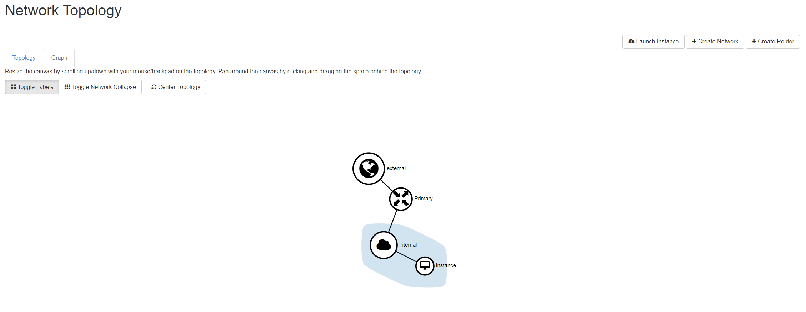

# Set up routers and security groups for your Project (Initial Network Setup)
This part may seem like putting the cart before the horse, but it's a quick and easy way to begin navigating the Openstack web interface. It's also important for the connectivity of all the instances that you decide to create. 

## Setting up the router
### Create the router
1. Click the `Network` drop down
2. Select the `Routers` option
3. Click `create router` 
4. Add a name for the router
5. Select the `external` network in the external network drop down
6. Click `Create Router`

### Add the interface for the internal network
1. Click on the router object you just created
2. Select the `interfaces` tab 
3. Click `Add interface`
4. Select the `internal subnet` from the internal network
5. Click `submit`

## Setting up Security Groups
1. Modify the Default Security Group
    1. Click on the `Security Groups` tab under the `network` drop down
    2. Click `Manage Rules` next to teh default gorup 
    3. Delete the **ingress** rules from the Security Group
    4. Click  `add rule`
    5. In the "add rule" menu, select `Other Protocol` from the first drop down menu
    6. Ensure that the cardinality is set to `ingress`
    7. In the "IP Protocol" field, enter `-1`
    8. Ensure that the `remote` field is set to CIDR
    9. In the "CIDR" field, add the value `0.0.0.0/0`
    10. Click `add `
2. Add a restricted Security Group for sensitive images
    1. In the `Security Groups` tab, click `Create Security Group`
    2. Name the Security Group `Restricted`
    3. Delete both of the default egress rules that are created with the new Security Group
    4. Add the following rules by clicking the `Add rule` button in the top right:

| RULE | DIRECTION | IP PROTOCOL | REMOTE TYPE | REMOTE PARAMETER |
|------|-----------|-------------|-------------|------------------|
| Other Protocol | Ingress | -1 | CIDR | 0.0.0.0/0 |
| Other Protocol | Egress | -1 | Security Groups | Default | 
| Other Protocol | Egress | -1 | Security Groups | Restricted |

?> This allows for all hosts to reach an instance in this security group (ingress), and for only hosts that are internal to Openstack to be reached by the instances in this group (egress)