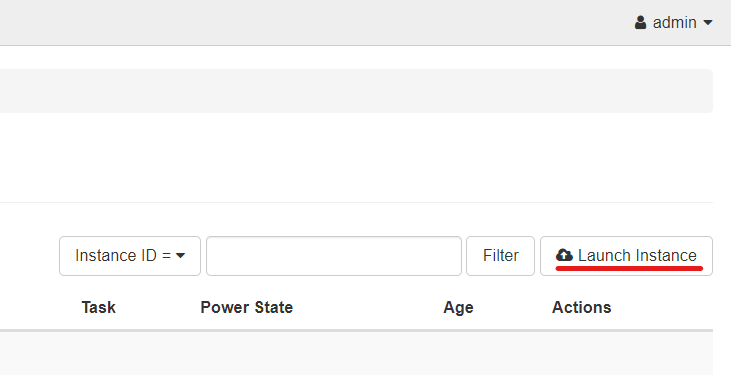

# Setup an instance in Openstack
<!--Maybe record a video for this one?-->
?> Before you create your first instance, make sure that you have created the first router for your project - see the ["Initial Network Setup Guide"](/Openstack-Image/initial-network-setup.md) for details.

## Creating an Instance

1. Select the `Instances` menu under the `Compute` drop down within the `Project` header on the right side menu
2. Click  `Launch Instance` in the top right corner 
3. Fill in the Details Section
    * Enter a name for the instance that you want to create
    * Add a description if you like - an explanation of what you're using the image for could be useful
4. Click the `source` tab
    * Ensure that `No` is selected as the response for the "Create New Volume" prompt
    * Select the image that you want to use for your instance
5. Click the `flavor` tab
    * Select the [flavor](/Openstack-Information/getting-started?id=flavors) that you want to allocate for your instance
6. Click the `networks` tab
    * Add an internal network to yoiur instance
7. Click `lanch instance` button

<!--Maybe add the option to change security groups?-->