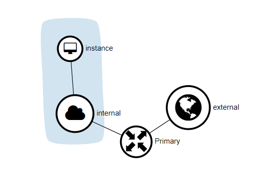
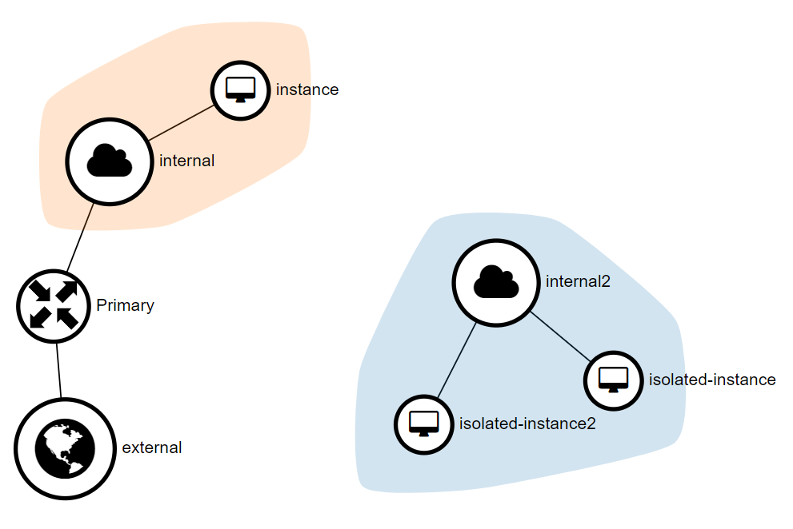
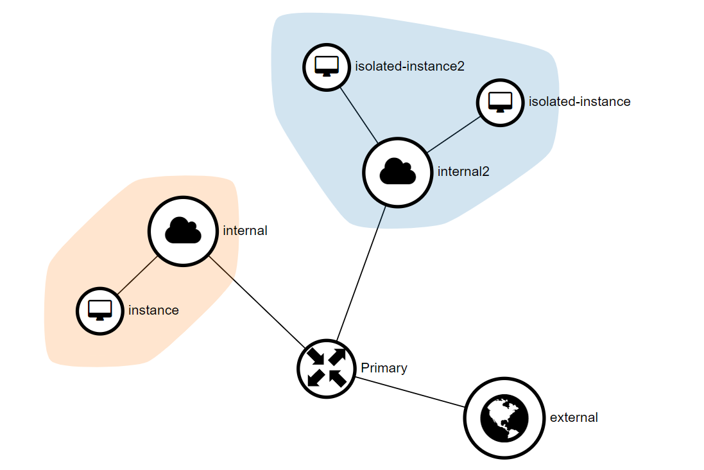

# Basics of Neutron Networking
<!-- Define the terms - what's a floating IP and why is it different than an internal IP, what's the router really doing, where do users need to look to get the systems online, etc -->
There's a lot to learn with Neutron networking. This article covers some of the basic components for networking within Openstack. 

## Network Layout and Components
### Internal and External Networks {docsify-ignore}
Openstack has two types of networks. Internal and External. Internal networks are, as the name might entail, internal to the Openstack environment. External networks are networks that are built to mirror a real network, and will defer some of their duties to the infrastructure in the actual physical external network. Internal networks can get internet access through the use of [NAT through a router](/Openstack-Information/understanding-networking?id=example-1-basic-layout-default-recommendation). 

#### Internal IP Addresses vs Floating IP Addresses
| Internal Addresses | Floating IP Addresses |
|-|-|
| Created and handled exclusively inside the Neutron environment. They have no connection to any network outside of Openstack without additional configuration | IPs from a DHCP range configured in Openstack. "Disable DHCP" will only prevent Openstack from issuing addresses to non-openstack hosts. DHCP on the external network will not be referenced by Openstack Machines |
#### External (Floating) IP Addresses

#### Multiple External networks {docsify-ignore}
Multiple External networks can be used to expose the services hosted in the Openstack environment to multiple networks. For example if you are hosting public-facing infrastructure like web or file servers, you may want the first external network to be the actual internet, but for internally accessed resources, you could use the local network of the physical locatiion (10.0.0.1/8 as an example) for the second external network. For our use, we will only have one external network. 

#### Multiple Internal Networks {docsify-ignore}
Multiple Internal networks can be created to group together or isolate your hosts (See [example 2](Openstack-Information/understanding-networking?id=example-2-network-isolation-with-multiple-internal-networks) below). 

### Routers {docsify-ignore}
Routers are just virtual routers that perform and behave in much the same way you would expect a real router to. Routers are the tool that allows you to provide access to the external network from an internal network, or access between internal networks. 

### Security Groups {docsify-ignore}
Security Groups are the host group-based firewall policy applied on the networks within Openstack. Any data that Neutron handles will have Security Group rules applied to it. Security Groups can allow you to block connections based on protocol, port, destination, or source. 

Openstack's default Security Group (Called "Default") allows for all outbound traffic, regardless of port, protocol, or destination, but prevents inbound access to the hosts in the Openstack environment. Communication between the hosts in the environment is allowed, but access from non-openstack hosts is blocked. 

If you have followed the steps in the [initial network setup guide](/Openstack-Information/initial-network-setup.md), your default group will allow all inbound and outbound traffic for the sake of simplicity. You should also have an additional "restricted" group that restricts traffic inbound and outbound with the external network - this group can only access hosts local to the openstack environemnt, but can be accessed from anywhere.

## Network Layout Examples
### Example 1: Basic Layout (Default Recommendation) {docsify-ignore}

In this example, the network is built to facilitate the most basic functionality. It will allow any host that is connected to the network named "internal" to access the internet through NAT on the router named "primary" over the network named "external". 

---
### Example 2: Network Isolation with multiple Internal Networks {docsify-ignore}

In this example, we have three hosts: ***Instance***, ***Isolated Instance***, and ***Isolated Instance 2***. ***Instance*** is connected to the network "Internal" and has access to the internet through our router and external network, just like in example one. 

***Isolated Instance***, and ***Isolated Instance 2*** are both connected to the network "Internal 2". These two hosts are capable of communicating with one another, since they are connected to the same network together. Neither of these instances have access to the internet, and likewise, neither have access to ***Instance*** due to the networks being isolated from one another.

---
### Example 3: Host Grouping with Multiple Internal Networks {docsify-ignore}

In the final example, we have networks that are setup separately, but connected via a shared router. This allows for the host ***Instance*** to communicate to both the hosts on the "Internal 2" network and vice versa. This setup is great for implementing Security Group policy to enforce tighter standards. For example, you could create a rule that only allows certain protocols to certain hosts if it's traveling between the two networks. In other words, you can enforce security globally based on the network addresses, instead of on a per-host basis. This would be a common characteristic for a microservice architected project - a usecase that is a bit outside of the capabilities of this system, but still useful to know.

## Additional Resources
#### Some helpful basics:

[Intro to Neutron Routers and Networks (video - 20m)](https://www.youtube.com/watch?v=yqFpyubsYfE)

[Openstack Networking Introduction](https://docs.openstack.org/neutron/wallaby/admin/intro.html)

#### Adavnced Neutron Networking (you don't *need* to know this):

[The journey of a packet through the Neutron Stack (video - 39m)](https://www.youtube.com/watch?v=uKgMp5c6R-4)

[Trunking in Openstack](https://docs.openstack.org/ocata/networking-guide/config-trunking.html)