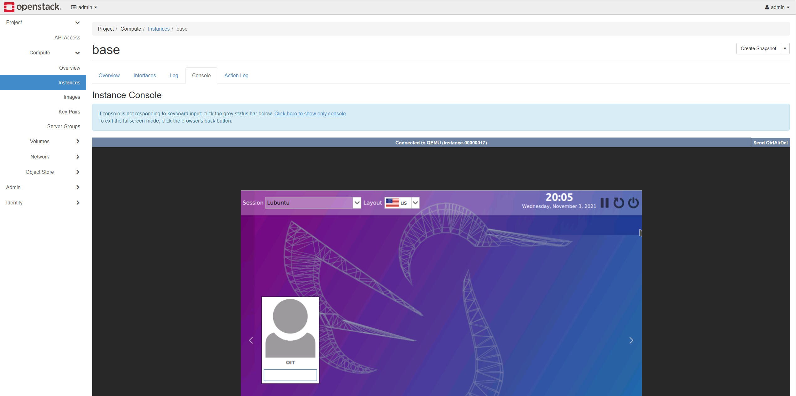

# Access your Openstack Instances
Instances can be accessed from your computer in a few ways! In this section, you can read about some of the standards that we can use to do so. 

As a first action, you should make sure that you have an instance setup and ready to be accessed (at least connected to the [internal network](/Openstack-Information/add-internal-ip.md)). If you have not done this, check out the ["Setup and Instance"](/Openstack-Information/setup-an-instance.md) page for more information on getting setup. 

## Accessing instances through the web browser
Openstack has native support for a console environment (with a GUI if it's installed on the image) from the Horizon web interface. This will likely suffice for any needs that you might have when working with the instances that you create. 
 

1. Select the `Instances` menu under the `Compute` drop down within the `Project` header on the right side menu
2. Click the `Create Snapshot` dropdown next to the instance
3. Select `Console` from the drop down 

## Accessing isntances through SSH
Instances should generally have SSH enabled on them for you to access from your computer directly to the client without the use of the Horizon web interface. 

?> NOTE: This access method will *require* a floating IP to facilitate the connection from your computer to the instance. If you have not associated a floating IP with your instance, you will be limited to the console access described above. For more information on floatin IP addresses, see the ["Add an external IP"](/Openstack-Information/add-external-ip.md) page. 

* Within your SSH client of choice, specify the floating IP address of the machine that you're looking to access, sign in using the username and password specified in the documentation for the image that you're using.
