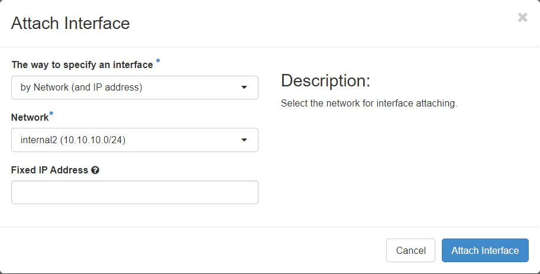

# Add an internal IP address

> Generally, you don't have to worry about specifically assigning internal IP addresses like you do with external/floating IP addresses. 

Internal IP addresses will automatically be associated with instances if they are added to an internal network. If you have followed the steps in the ["Setup an Instance"](/Openstack-Information/setup-an-instance.md) guide, you should already have an interface associated with an internal IP address assigned to the machine.

To add an additional Internal IP address, simply...
1. click on the `create snapshot` drop down
2. select `attach interface`
3. Specify the internal network that you want to connect to the instance
4. click `attach interface` to add it to the host. This will automatically fetch an IP address from the DHCP configuration for the internal network. 